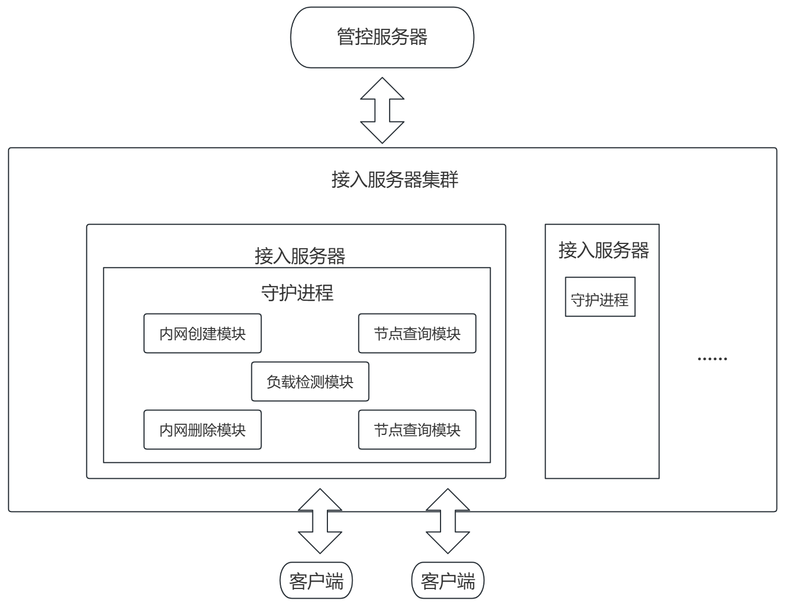
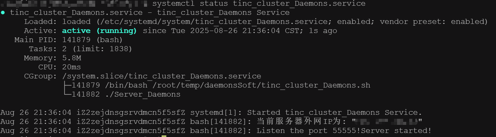

# tinc-cluster-daemons

Tinc是一种基于GNU协议的开源轻量级VPN软件，其核心设计采用分布式点对点（P2P）架构，通过IP层隧道技术与加密协议在互联网节点间建立安全通信链路。

## 系统架构示意图

 

## 项目简介

+ tinc-cluster-daemons是基于tinc内网穿透集群管控系统的接入服务器集群部分。
+ 接入服务器集群是由多台服务器共同组成。
+ 接入服务器部署守护进程，提供接入服务。
+ 守护进程主要的作用是，接收管控服务器下发的指令，在接入服务器上完成对应的操作。
+ 守护进程的功能模块包括：内网的增删，节点的增删查，服务器负载状态检测

## 项目文件夹说明
image：markdown所需图片
daemonsSoft：包含守护进程，守护进程启动脚本，守护进程停止脚本
Automatic_deployment.sh：自动部署脚本，运行后根据所在目录自动部署守护进程。

PS：运行自动部署脚本前，请确保部署脚本与文件夹在同一目录下

## 部署方式 

+ 下载守护程序
+ 上传至服务器
+ 赋予自动部署脚本权限
+ 运行自动部署脚本

## 运行示例

 

## 联系我们
QQ邮箱：1241569620@qq.com